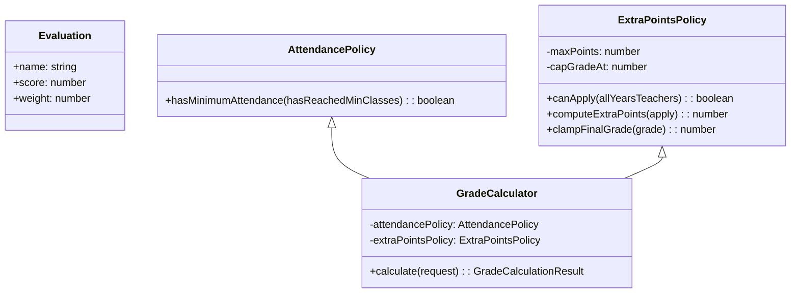

# CS-GradeCalculator

CLI en TypeScript que permite a docentes de UTEC registrar evaluaciones y calcular la nota final de un estudiante cumpliendo con los RF01–RF05 y RNF01–RNF04.

## Requisitos previos
- Node.js 20+
- npm 10+

## Instalación y ejecución
1. Instalar dependencias: `npm install`
2. Ejecutar el CLI en modo desarrollo: `npm start`
3. Construir artefactos compilados: `npm run build`
4. Ejecutar la versión compilada: `npm run start:prod`

Durante la ejecución se solicitarán: código de estudiante, evaluaciones (máx. 10), indicador de asistencia mínima y políticas anuales de puntos extra. El sistema imprime el detalle del cálculo (promedio, asistencia, política y nota final).

## Arquitectura y diseño
- `Evaluation`: encapsula validaciones de nombre, nota (0–20) y peso porcentual.
- `AttendancePolicy`: centraliza la verificación de asistencia mínima.
- `ExtraPointsPolicy`: decide si se aplica la bonificación (requiere unanimidad anual) y limita la nota máxima.
- `GradeCalculator`: coordina la lógica, valida RNF01, garantiza determinismo y aplica los puntos extra.
- `src/app/cli.ts`: orquesta la captura de datos mediante `readline/promises` y muestra el desglose solicitado por RF05.

### UML simplificado

## Cumplimiento de RF/RNF
- **RF01**: ingreso de evaluaciones mediante el CLI; cada registro crea una instancia de `Evaluation`.
- **RF02**: pregunta directa sobre asistencia y evaluación mediante `AttendancePolicy`.
- **RF03**: captura dinámica de `allYearsTeachers` (hasta 50 registros) para reflejar la decisión anual.
- **RF04**: `GradeCalculator.calculate` produce la nota final con ponderaciones + políticas.
- **RF05**: se imprime el detalle (promedio, asistencia, política y bonificación aplicada).
- **RNF01**: validación estricta (máx. 10 evaluaciones) en CLI y `GradeCalculator`.
- **RNF02**: la aplicación es stateless e idempotente, por lo que puede ejecutarse en paralelo hasta 50 usuarios sin compartir estado.
- **RNF03**: las operaciones son puras y deterministas; no existe aleatoriedad ni estado externo.
- **RNF04**: el cálculo es O(n) sobre ≤10 evaluaciones, garantizando tiempos <300 ms.

## Pruebas automatizadas
- Ejecutar `npm test` para correr los 7 tests de Vitest (`tests/gradeCalculator.test.ts`).
- Casos cubiertos: cálculo estándar, ausencia de asistencia mínima, desacuerdo docente, tope de nota, colección vacía, exceso de evaluaciones y pesos inválidos.
- La nomenclatura `shouldXWhenY` facilita la trazabilidad con RF/RNF.

## Supuestos y decisiones
- Las notas se encuentran en escala 0–20 y la suma de pesos debe ser 100.
- La bonificación solo se aplica si **todos** los docentes (lista `allYearsTeachers`) aprueban en el año correspondiente.
- El valor de puntos extra es configurable (0–5) en el CLI y la nota final se limita por defecto a 20.
- No se implementó persistencia, coherente con el alcance solicitado.

Este proyecto fue evaluado usando el quality gate de Sonar. Puedes ver los resultados aquí: [Quality Gate Sonar](http://213.199.42.57:9002/quality_gates/show/SONNAR)